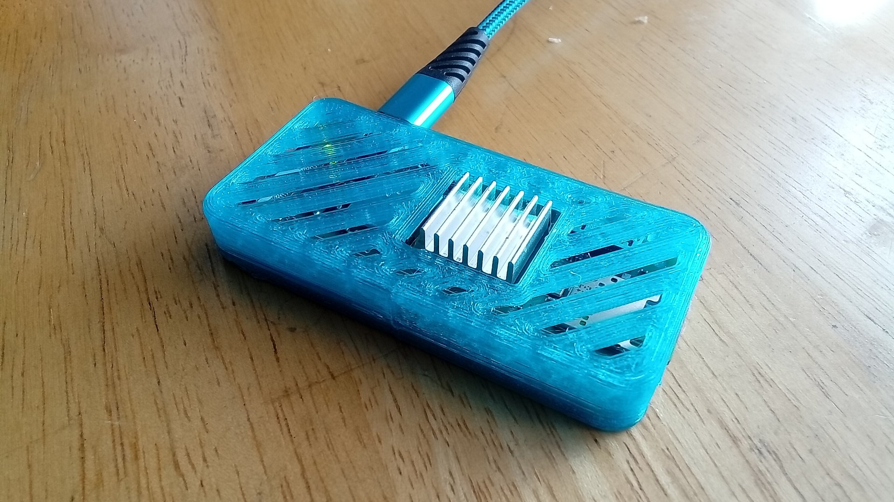
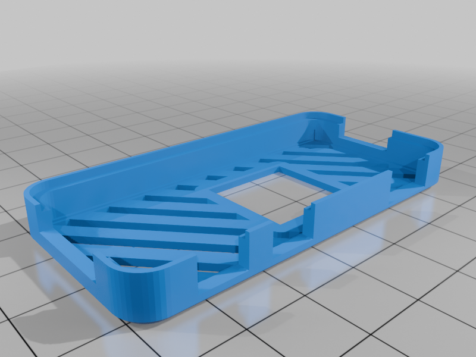
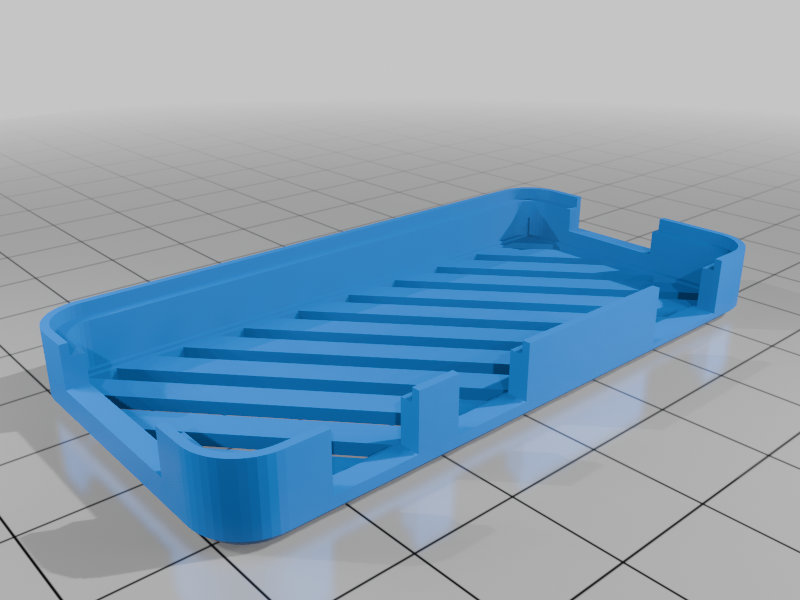
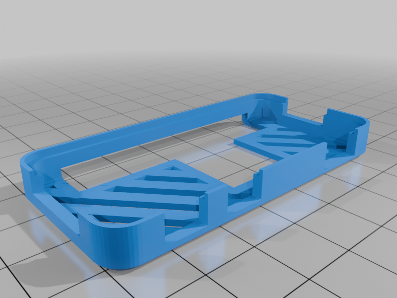
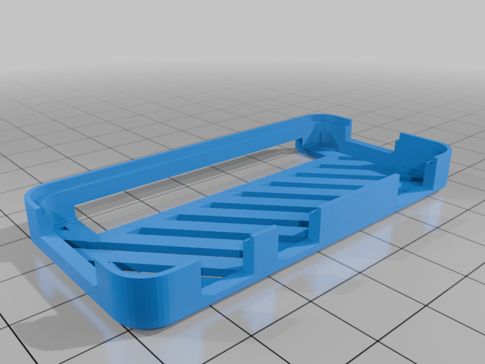
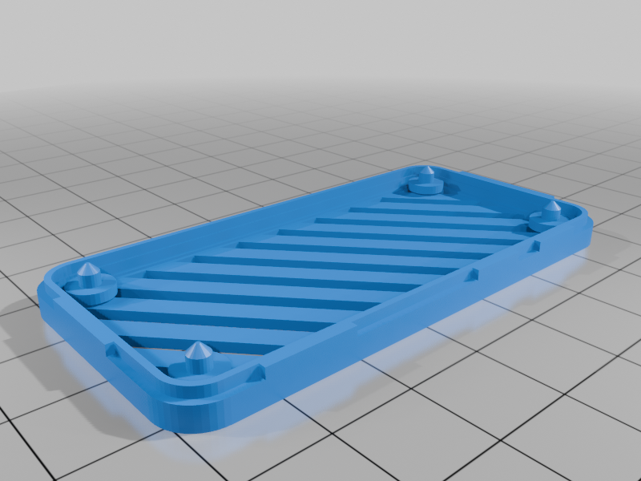

# Pi Zero w/Pi Zero 2 w - Simple Slotted Case
#### On Thingiverse: [https://www.thingiverse.com/thing:7082950](https://www.thingiverse.com/thing:7082950)

This simple slotted case for Pi Zero w/Pi Zero 2 w is based on (and also compatible with) [doctriam's](https://www.thingiverse.com/doctriam/designs) excellent design found here--[https://www.thingiverse.com/thing:2480624](https://www.thingiverse.com/thing:2480624)

#### Print Settings

    Printer brand:
    Creality
    
    Printer:
    Ender-3 S1 Pro
    
    Rafts:
    No
    
    Supports:
    No
    
    Resolution:
    0.4
    
    Infill:
    100%
    
    Filament material:
    PLA Pro
    
    Filament brand:
    Ziro
    
    Filament color:
    Transparent Blue

#### How I Designed This

FreeCAD
